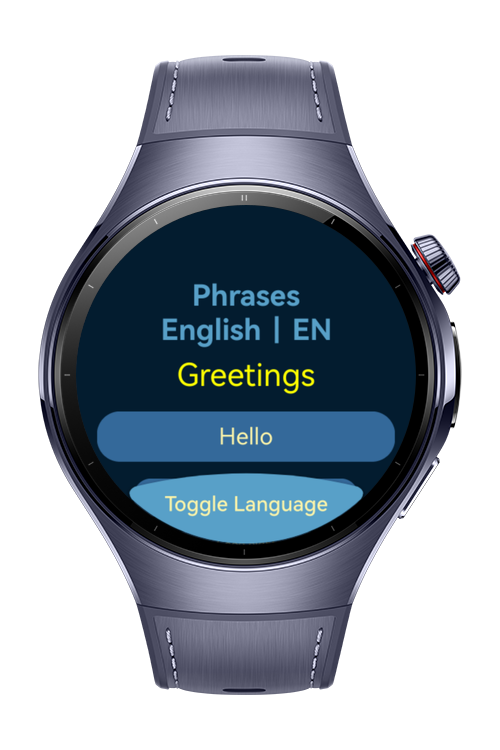
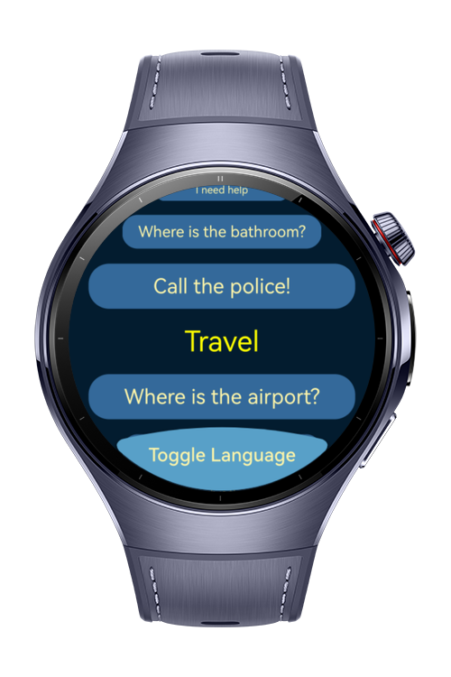
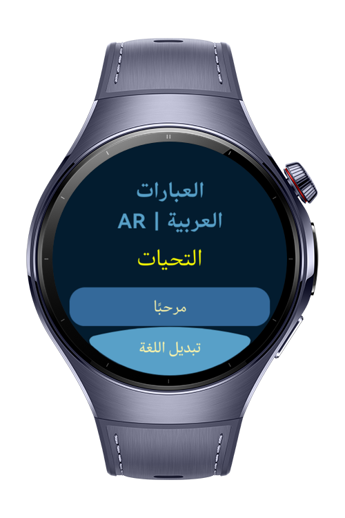
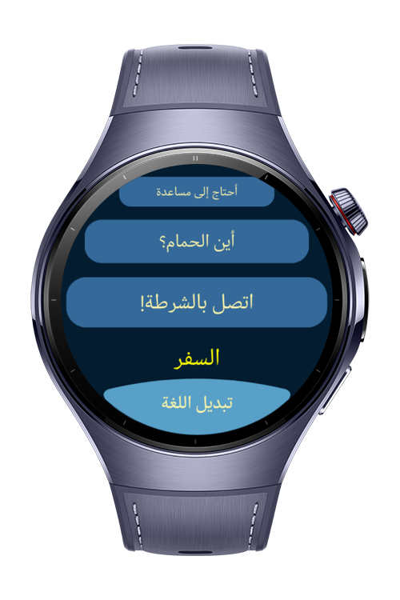

> **Note:** To access all shared projects, get information about environment setup, and view other guides, please visit [Explore-In-HMOS-Wearable Index](https://github.com/Explore-In-HMOS-Wearable/hmos-index).

# Bilingual Phrasebook

A simple bilingual phrasebook app for HarmonyOS Next written in ArkTS.

BilingualPhrasebook is a multilingual app designed to help users quickly access common phrases in both **Arabic** and **English**.
It supports **RTL** and **LTR** layouts, utilizes localized resources, and adapts the UI direction based on the selected system locale.

# Preview

<div>
    
    
    
    
</div>

# Use Cases

Bilingual Phrasebook helps users quickly find and practice essential phrases in two languages, making it ideal for travel, language learning, and real-life conversations.

# Technology

## Stack

- **Languages**: ArkTS, Typescript
- **Frameworks**: HarmonyOS SDK 5.1.0(18)
- **Tools**: DevEco Studio Version 5.1.0.828
- **Libraries**:
    - `@kit.ArkUI`
    - `@kit.AbilityKit`
    - `@kit.BasicServicesKit`
    - `@kit.LocalizationKit`
    - `@kit.ArkData`

## Localization Kit Usage

This app utilizes the **Localization Kit** to manage multi-language content:

- Uses `$r('app.string.key')` for fetching localized string resources
- Arabic (RTL) and English (LTR) string files are defined under `resources/base/element/string.json`
  and `resources/ar/element/string.json`
- Locale switching is handled within the app using `i18n.System` and User-Preferences `PreferencesManager`
- Custom `LocaleManager` provides helpers for accessing or reacting to the current language

Example file:

- `src/main/ets/utils/LocaleManager.ets`

## Dependency Injection (Registry-Based)

This project includes a lightweight, custom **Dependency Injection (DI)** system, implemented with decorators and a
central service registry.

- Services are registered in `MainRegistry.ets` using `@Register()` decorators
- Classes can `@Resolve()` dependencies without manually wiring them
- Lazy and singleton services are supported via internal `ServiceRegistry.ts`

Example files:

- `src/main/ets/di/MainRegistry.ets` – Application-level service registration uses `@Register` to register a service.
- `src/main/ets/registry/Injectable.ts` – `Injectable` Interface, used to mark any class that will be injected later.
- `src/main/ets/registry/ServiceRegistry.ts` – Core service container, also has `@Register`, `@Resolve` decorators.

This allows separation of concerns and improved testability for components like:

- `PreferencesManager`
- `LocaleManager`
- ViewModels and utilities

# Directory Structure

```
├── entry/src/main/ets/
│   ├──components/                      // Reusable UI components (PhraseCard, PhraseTitle)
│   ├──constants/                       // Constants like sizes
│   ├──di/                              // DI container and main registry
│   ├──entryability/
│   │  └──EntryAbility.ets              // Main entry point ability
│   ├──entrybackupability/
│   │  └──EntryBackupAbility.ets        // Backup entry ability
│   ├──model/                           // Data models and enums (AppLocale, PhraseModel)
│   ├──myabilitystage/
│   │  └──MyAbilityStage.ets            // Custom AbilityStage for config setup
│   ├──pages/
│   │  └──Index.ets                     // Main page of the app
│   ├──registry/                        // Decorators and DI service registry
│   ├──utils/
│   │  ├──preferences/                  // Preferences logic (keys, manager)
│   │  ├──LocaleManager.ets             // Locale switching logic
│   │  └──Logger.ets                    // Logging utility
│   └──viewmodel/
│      ├──PhrasesDataSource.ets         // Data source for grouped + flattened phrases
│      └──PhrasesViewModel.ets          // ViewModel managing phrases
```

# Constraints and Restrictions

## Supported Devices

- Huawei Watch 5

## Supported Locales

- Only supports two locales: `en` and `ar`

# LICENSE

Bilingual Phrasebook is distributed under the terms of the MIT License.
See the [license](/LICENSE) for more information.